<div align="center">

# 🧬 Deep-Learning-Plant-DNA-Optimization

### AI-powered plant DNA optimization, precision agriculture intelligence and full-stack mobile research platform.

[](https://flutter.dev)
[](https://fastapi.tiangolo.com)
[](https://www.python.org)
[](https://vite.dev)
[](https://pytorch.org)
[](https://www.tensorflow.org)
[](LICENSE)

**Repository description:** AI-powered plant DNA optimization platform combining Flutter, FastAPI, React, RAG, IoT and deep learning for precision agriculture.

</div>

---

## 🚀 Overview

**Deep-Learning-Plant-DNA-Optimization** is a multidisciplinary AI engineering project that connects plant genomics, pest detection, crop disease analysis, IoT greenhouse telemetry and scientific dashboards into one full-stack platform.

The system is designed as a recruiter/professor-facing portfolio project: a Flutter farmer app for field workflows, a FastAPI model gateway for research-grade inference, and a React/Vite analytical interface for exploring plant DNA, CRISPR, digital twin and agronomic prediction modules.

---

## ✨ Features & Modules

| Module | Capability | Engineering Focus |
| --- | --- | --- |
| Mobile Auth | Arabic login/signup with token persistence | Flutter, Dio, SharedPreferences |
| Plant Disease AI | Wheat leaf image classification | TensorFlow/Keras, image upload API |
| Pest Image AI | Pest image inference with top-k classes | PyTorch/TorchVision, EfficientNet-style serving |
| Insect Sound AI | Audio-based insect species recognition | PANN/CNN14, librosa, soundfile |
| CropDNA | DNA search, RAG answers, PDF generation | FAISS, LangChain, FastAPI routers |
| IoT Greenhouse | Plant telemetry, history and dashboard stats | WebSocket-ready FastAPI module |
| CRISPR Intelligence | CRISPR prediction and explainability endpoints | ML adapters, explainable outputs |
| Growth Simulator | Digital twin style crop growth scenarios | Simulation, agronomic modeling |
| Research Dashboard | Browser UI for analytical modules | React, Vite, TypeScript, Chart.js |

---

## 🏗️ Architecture

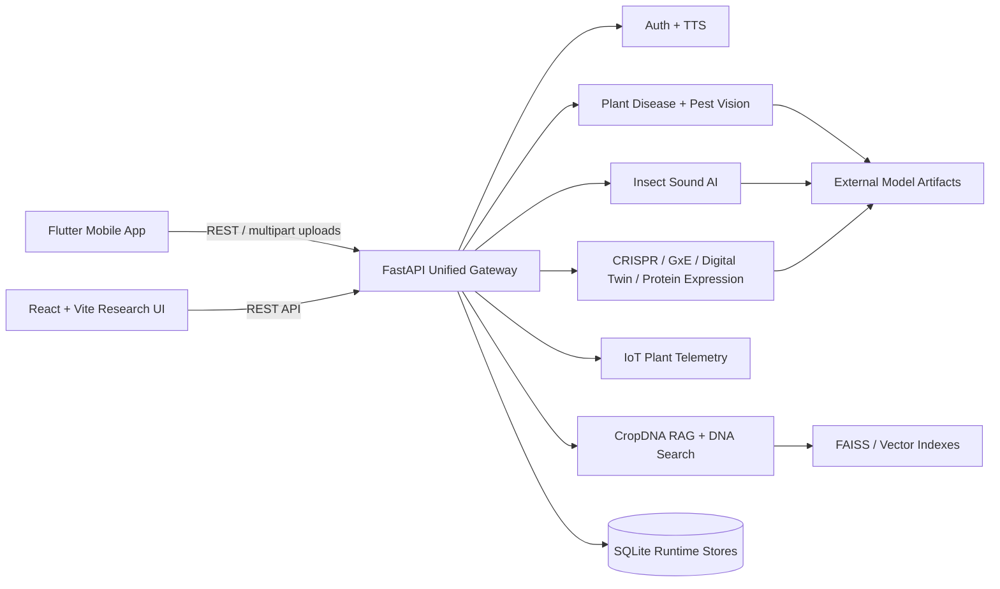

See [docs/ARCHITECTURE.md](docs/ARCHITECTURE.md) for runtime boundaries and deployment notes.

---

## 🧪 Tech Stack

### Application Layer

| Surface | Technologies |
| --- | --- |
| Mobile | Flutter, Dart, Riverpod, GoRouter, Dio, SharedPreferences |
| Backend | Python, FastAPI, Uvicorn, Pydantic, SQLAlchemy |
| Web dashboard | React 19, Vite, TypeScript, Tailwind CSS, Framer Motion |
| Visualization | Chart.js, React Chart.js, Three.js, Matplotlib |

### AI / ML Layer

| Domain | Technologies |
| --- | --- |
| Vision inference | TensorFlow, Keras, PyTorch, TorchVision, OpenCV, Pillow |
| Audio inference | CNN14/PANN-style model, librosa, soundfile |
| Genomics / RAG | LangChain, FAISS, ChromaDB, Transformers, Hugging Face tooling |
| Tabular ML | scikit-learn, XGBoost, LightGBM, SHAP |
| Simulation | SimPy, PCSE |

---

## 🔌 API Endpoints

| Endpoint | Method | Purpose |
| --- | --- | --- |
| `/health` | `GET` | Unified backend status |
| `/auth/signup` | `POST` | Create mobile user account |
| `/auth/login` | `POST` | Authenticate by email/phone |
| `/auth/me` | `GET` | Resolve current token user |
| `/tts` | `GET` | Arabic TTS proxy fallback |
| `/wheat/predict` | `POST` | Plant disease image inference |
| `/pest/predict` | `POST` | Pest image classifier |
| `/sound/predict` | `POST` | Insect audio classifier |
| `/cropdna/search` | `POST` | DNA/RAG search workflow |
| `/cropdna/api/iot/plants` | `GET` | IoT plant list |
| `/cropdna/api/iot/dashboard/stats` | `GET` | IoT dashboard summary |
| `/api/crispr/predict` | `POST` | CRISPR prediction |
| `/api/crispr/explain` | `POST` | Explain CRISPR prediction |
| `/growth/*` | `GET/POST` | Plant growth simulator routes |
| `/pharma/*` | `GET/POST` | Protein expression intelligence |

Interactive API documentation is available at `http://127.0.0.1:8000/docs` when the backend is running.

---

## 📁 Directory Structure

```text
.
├── lib/                         # Flutter mobile app source
│   ├── core/                    # Routing, services, providers, theme
│   ├── features/                # Auth, dashboard, plant disease, insect AI, IoT
│   └── widgets/                 # Shared mobile widgets
├── integration_web/
│   └── AgriCulture/
│       ├── cropdna/             # CropDNA RAG, IoT, DNA search modules
│       └── AgriCulture-1.0.0/
│           ├── AgriCulture-1.0.0/client/     # React/Vite research dashboard
│           └── intglalasouhaboub2/intglalasouhaboub2/
│               ├── main_combine.py           # Unified FastAPI gateway
│               ├── requirements.txt          # Backend dependency manifest
│               └── projet*/                  # Research ML modules
├── assets/
│   ├── icons/
│   ├── images/
│   └── screenshots/             # GitHub portfolio screenshots/placeholders
├── docs/                        # Architecture and artifact documentation
├── android/ ios/ web/ windows/  # Flutter platform targets
├── pubspec.yaml                 # Flutter dependencies
└── .env.example                 # Runtime configuration template
```

---

## ⚙️ Installation

### 1. Clone

```bash
git clone https://github.com/<your-username>/Deep-Learning-Plant-DNA-Optimization.git
cd Deep-Learning-Plant-DNA-Optimization
```

### 2. Flutter mobile app

```bash
flutter pub get
flutter analyze
flutter run --dart-define=API_BASE_URL=http://127.0.0.1:8000
```

For a physical Android phone on the same Wi-Fi/LAN, use your computer IP:

```bash
flutter run --dart-define=API_BASE_URL=http://YOUR_LAN_IP:8000
```

### 3. FastAPI backend

```bash
cd integration_web/AgriCulture/AgriCulture-1.0.0/intglalasouhaboub2/intglalasouhaboub2
python -m venv .venv
.\.venv\Scripts\activate
pip install -r requirements.txt
uvicorn main_combine:app --host 0.0.0.0 --port 8000 --reload
```

### 4. React research dashboard

```bash
cd integration_web/AgriCulture/AgriCulture-1.0.0/AgriCulture-1.0.0/client
npm install
npm run dev
```

---

## 🔐 Environment Variables

| Variable | Required | Description |
| --- | --- | --- |
| `API_BASE_URL` | Mobile runtime | Backend URL injected into Flutter builds |
| `API_HOST` | Optional | FastAPI bind host, defaults to `0.0.0.0` |
| `API_PORT` | Optional | FastAPI port, defaults to `8000` |
| `CORS_ORIGINS` | Optional | Allowed frontend origins |
| `MODEL_ARTIFACT_DIR` | Recommended | External model/data artifact directory |
| `GROQ_API_KEY` | Optional | Groq-backed RAG/LLM workflows |
| `OPENAI_API_KEY` | Optional | Optional LLM integrations |
| `ANTHROPIC_API_KEY` | Optional | Optional notifier/agent integrations |
| `TWILIO_ACCOUNT_SID` | Optional | SMS/notification integration |
| `TWILIO_AUTH_TOKEN` | Optional | SMS/notification integration |

Start from [.env.example](.env.example).

---

## 🖼️ Screenshots

| Mobile | AI Field Workflow |
| --- | --- |
| 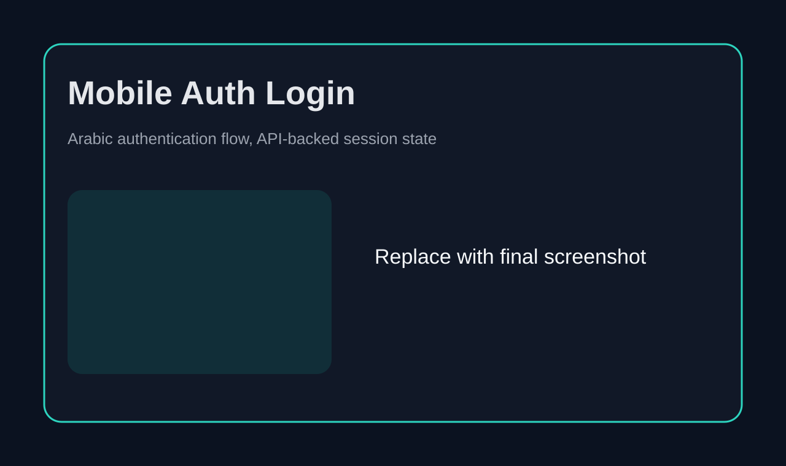 | 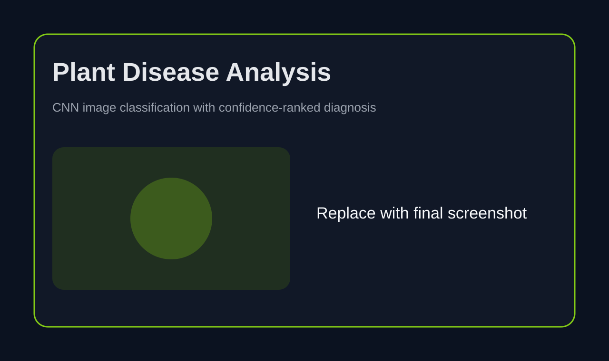 |
| 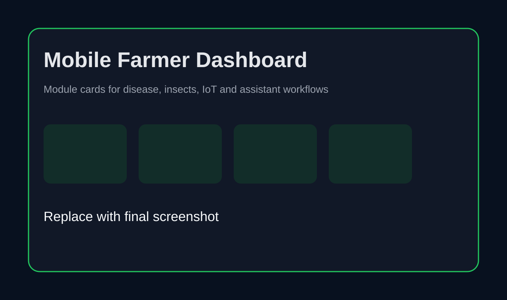 | 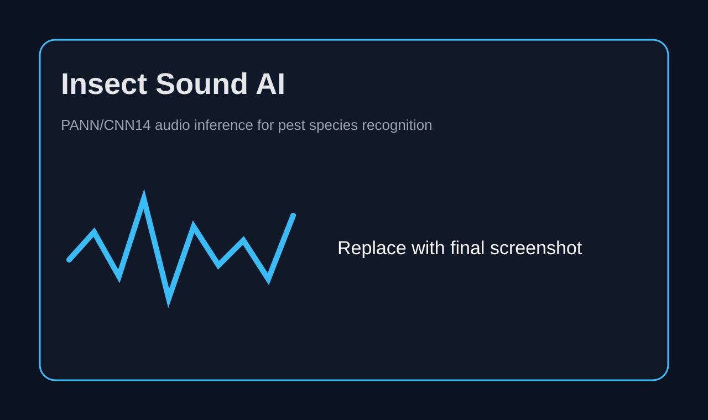 |

| Research Dashboard | Genomics & Forecasting |
| --- | --- |
| 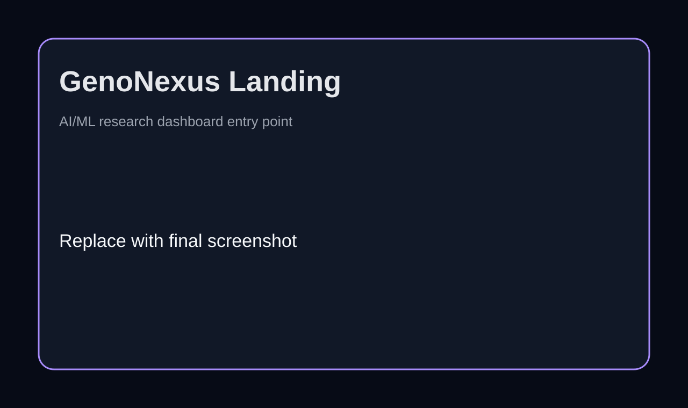 | 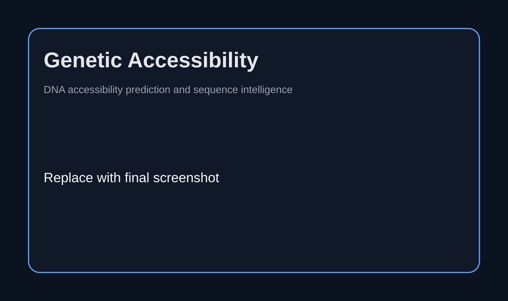 |
| 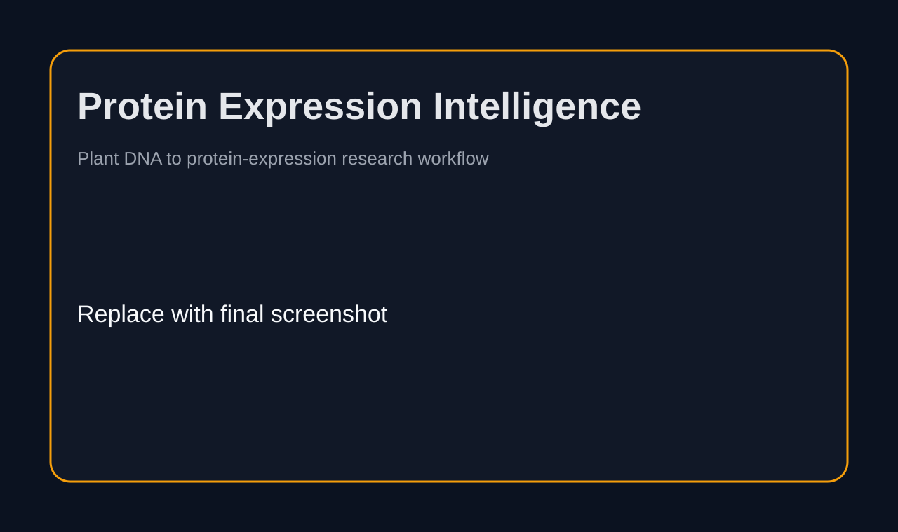 | 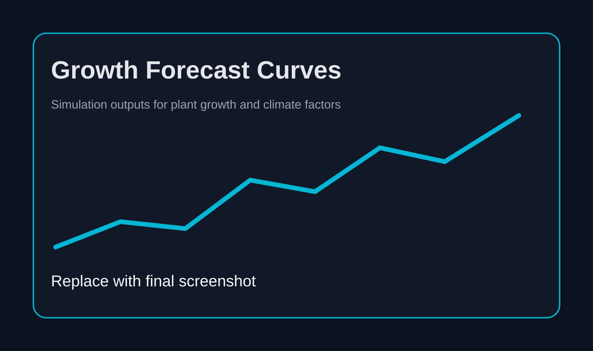 |
| 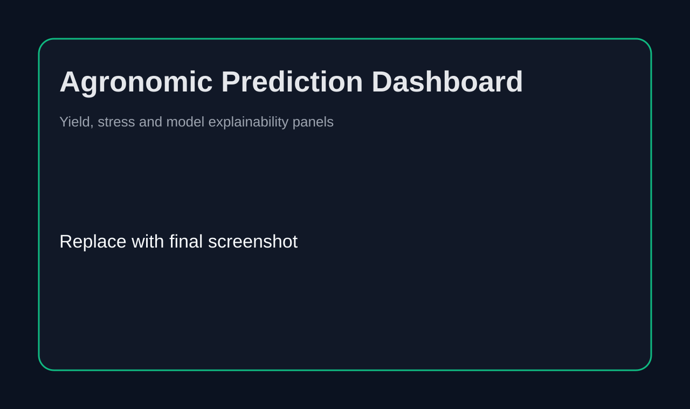 | 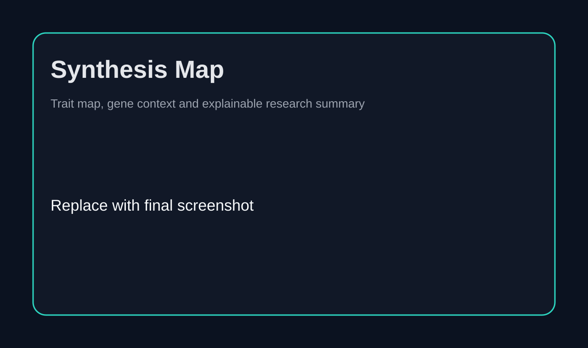 |

---

## 🧭 Roadmap

| Milestone | Status |
| --- | --- |
| External artifact downloader for model weights | Planned |
| Docker Compose profile for API + web dashboard | Planned |
| GitHub Actions for Flutter analyze and Python lint | Planned |
| Model registry documentation with checksums | Planned |
| API contract tests for mobile workflows | Planned |
| Production auth hardening and token expiration | Planned |

---

## 📦 Artifact Strategy

Large model weights, vector indexes, genomic datasets, runtime databases and generated outputs are intentionally excluded from Git. See [docs/ARTIFACTS.md](docs/ARTIFACTS.md) for the storage policy.

This keeps the repository reviewable, cloneable and compliant with GitHub file-size limits while preserving a production-style separation between source code and deploy-time model assets.

---

## 🙏 Acknowledgments

Built as an AI/ML engineering portfolio project for precision agriculture, plant genomics and applied deep learning. The project integrates concepts from modern mobile engineering, research dashboards, FastAPI model serving, RAG systems, crop science and explainable ML.

---

<div align="center">

**From plant signals to actionable AI intelligence.**

</div>

<!-- certifications:start -->
## Relevant Certifications

Related training completed by **Melek Moalla**, with the connection to this project stated below.

<a href="https://learn.nvidia.com/certificates?id=nQezqvF2S3GIgeoy1hNHKw">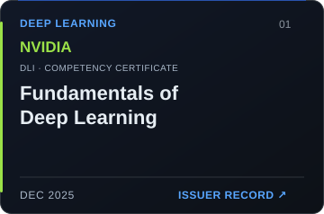</a>

**NVIDIA · Fundamentals of Deep Learning**  
Related to the TensorFlow/Keras CNN inference path in CropDNA and the project’s neural vision and audio modules.  
[Verify / issuer record](https://learn.nvidia.com/certificates?id=nQezqvF2S3GIgeoy1hNHKw) · [Original PDF](https://github.com/MoallaMelek/MoallaMelek/blob/master/certificates/nvidia-deep-learning.pdf)

<a href="https://learn.nvidia.com/certificates?id=IkT2VY9-TWGR3EvSAaeFNA">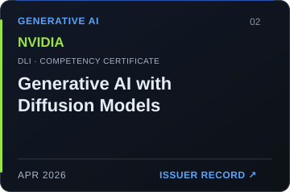</a>

**NVIDIA · Generative AI with Diffusion Models**  
Complementary training in generative model methods alongside the project’s neural inference and RAG work. This repository does not implement diffusion models.  
[Verify / issuer record](https://learn.nvidia.com/certificates?id=IkT2VY9-TWGR3EvSAaeFNA) · [Original PDF](https://github.com/MoallaMelek/MoallaMelek/blob/master/certificates/nvidia-diffusion.pdf)

<a href="https://coursera.org/verify/KN4I9UGNT0WZ"></a>

**Amazon Web Services · Gen AI Dev- Analyze Requirements & Design GenAI Solutions**  
Related to designing the CropDNA retrieval-augmented workflow, grounding answers in retrieved sources, and integrating it with the FastAPI application.  
[Verify / issuer record](https://coursera.org/verify/KN4I9UGNT0WZ) · [Original PDF](https://github.com/MoallaMelek/MoallaMelek/blob/master/certificates/aws-genai-design.pdf)

<sub>The AWS credentials are Coursera course completions. The association concerns learning; it does not claim an AWS deployment or issuer endorsement.</sub>

<!-- certifications:end -->
