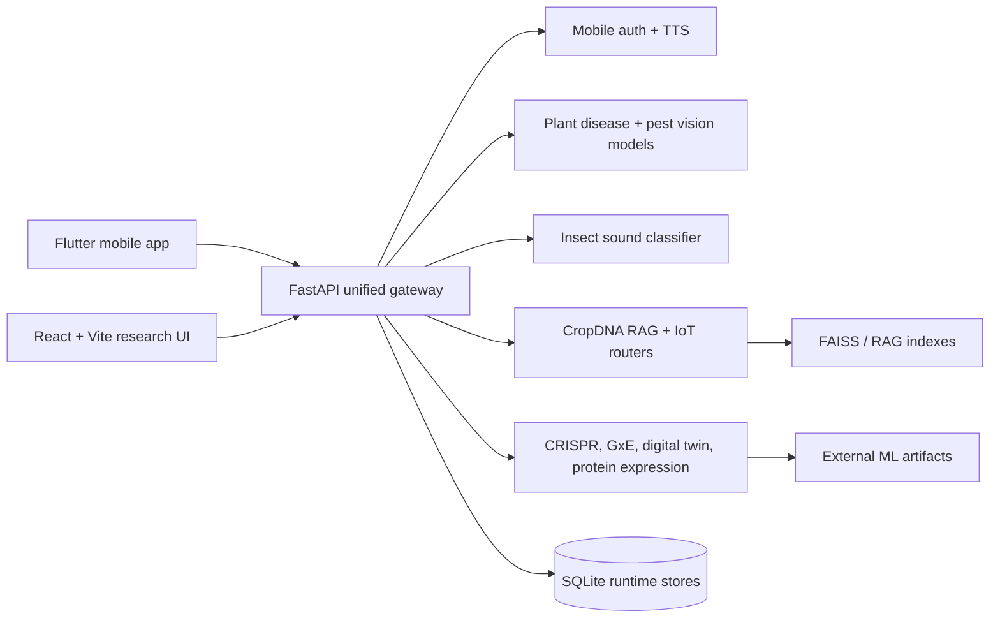

# Architecture

Deep-Learning-Plant-DNA-Optimization combines three delivery surfaces: a Flutter mobile app, a React/Vite research dashboard, and a unified FastAPI backend that orchestrates ML, RAG, IoT and domain-specific plant science modules.



## Runtime Boundaries

| Layer | Responsibility | Primary paths |
| --- | --- | --- |
| Mobile app | Farmer-facing workflows, Arabic UX, capture/upload flows, TTS fallback | `lib/`, `android/`, `ios/` |
| Research web | Analytical dashboards, charts, research modules and visual exploration | `integration_web/AgriCulture/AgriCulture-1.0.0/AgriCulture-1.0.0/client/` |
| API gateway | Unified HTTP API, auth, CORS, route composition, model adapters | `integration_web/AgriCulture/AgriCulture-1.0.0/intglalasouhaboub2/intglalasouhaboub2/main_combine.py` |
| CropDNA | DNA search, RAG, IoT greenhouse telemetry and PDF generation | `integration_web/AgriCulture/cropdna/` |
| Artifacts | Model weights, indexes, datasets and generated outputs stored outside Git | `artifacts/`, `models/`, external storage |

## Deployment Notes

The physical Android APK must reach the backend through the host machine LAN IP:

```bash
flutter run --dart-define=API_BASE_URL=http://YOUR_LAN_IP:8000
```

For production, place model weights in an artifact bucket or release asset and inject the path with `MODEL_ARTIFACT_DIR`.
